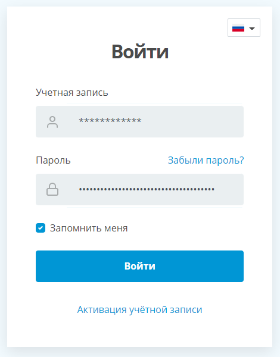

# Протокол HTTP. Основы работы с консолью разработчика в браузере

## Цель:
Получить практические навыки работы с HTTP протоколом. На практике проанализировать процесс аутентификации пользователей в двух произвольных web-ресурсах.

## Постановка задачи:
Написать эссе, в котором анализируется процесс аутентификации пользователей в двух произвольных web-ресурсах.

## Эссе
## Начнем с анализа [Монополии](https://monopoly-one.com/auth)


Нажимаем "Войти через вконтакте" и получаем:

```yaml
:authority: oauth.vk.com
:method: GET
:path: /authorize?v=5.73&client_id=4917652&redirect_uri=https%3A%2F%2Fmonopoly-one.com%2Fauth-social%2Fvk&scope=email&response_type=code
:scheme: https
accept: text/html,application/xhtml+xml,application/xml;q=0.9,image/avif,image/webp,image/apng,*/*;q=0.8,application/signed-exchange;v=b3;q=0.9
accept-encoding: gzip, deflate, br
accept-language: ru-RU,ru;q=0.9,en-GB;q=0.8,en;q=0.7,en-US;q=0.6
cookie: remixstid=1206138037_Y3B1ELuKpHKIRShf2SaWnbuU219ZVGeuUKV0FaDjbDo; remixlhk=ca64a4951ee0699288; remixrefkey=ad82cd2d783e3d2a71; remixscreen_width=2560; remixscreen_depth=24; remixscreen_dpr=1; remixscreen_height=1440; remixscreen_winzoom=0; remixdt=25200; remixlang=0; remixlgck=257aa7e3428f3ba68e
sec-ch-ua: "Chromium";v="94", "Google Chrome";v="94", ";Not A Brand";v="99"
sec-ch-ua-mobile: ?0
sec-ch-ua-platform: "Windows"
sec-fetch-dest: document
sec-fetch-mode: navigate
sec-fetch-site: cross-site
sec-fetch-user: ?1
upgrade-insecure-requests: 1
user-agent: Mozilla/5.0 (Windows NT 10.0; Win64; x64) AppleWebKit/537.36 (KHTML, like Gecko) Chrome/94.0.4606.61 Safari/537.36
```

Ввлдим данные и нажимаем "Войти":


Посылается `POST` запрос:
```yaml
:authority: login.vk.com
:method: POST
:path: /?act=login&soft=1
:scheme: https
accept: text/html,application/xhtml+xml,application/xml;q=0.9,image/avif,image/webp,image/apng,*/*;q=0.8,application/signed-exchange;v=b3;q=0.9
accept-encoding: gzip, deflate, br
accept-language: ru-RU,ru;q=0.9,en-GB;q=0.8,en;q=0.7,en-US;q=0.6
cache-control: max-age=0
content-length: 396
content-type: application/x-www-form-urlencoded
cookie: remixstid=1206138037_Y3B1ELuKpHKIRShf2SaWnbuU219ZVGeuUKV0FaDjbDo; remixlhk=ca64a4951ee0699288; remixrefkey=ad82cd2d783e3d2a71; remixscreen_width=2560; remixscreen_depth=24; remixscreen_dpr=1; remixscreen_height=1440; remixscreen_winzoom=0; remixdt=25200; remixlang=0; remixlgck=257aa7e3428f3ba68e
origin: https://oauth.vk.com
referer: https://oauth.vk.com/
sec-ch-ua: "Chromium";v="94", "Google Chrome";v="94", ";Not A Brand";v="99"
sec-ch-ua-mobile: ?0
sec-ch-ua-platform: "Windows"
sec-fetch-dest: document
sec-fetch-mode: navigate
sec-fetch-site: same-site
sec-fetch-user: ?1
upgrade-insecure-requests: 1
user-agent: Mozilla/5.0 (Windows NT 10.0; Win64; x64) AppleWebKit/537.36 (KHTML, like Gecko) Chrome/94.0.4606.61 Safari/537.36
```

Так же имеется поле `Form Data`, которое содержит введеный логин `email` и пароль `pass`:
```yaml
ip_h: 330f0a1198c9dc0ba1
lg_h: c667cfdbf64ec0c485
lg_domain_h: f9f8d5db27e45a6245
_origin: https://oauth.vk.com
to: aHR0cHM6Ly9vYXV0aC52ay5jb20vYXV0aG9yaXplP2NsaWVudF9pZD00OTE3NjUyJnJlZGlyZWN0X3VyaT1odHRwcyUzQSUyRiUyRm1vbm9wb2x5LW9uZS5jb20lMkZhdXRoLXNvY2lhbCUyRnZrJnJlc3BvbnNlX3R5cGU9Y29kZSZzY29wZT00MTk0MzA0JnY9NS43MyZzdGF0ZT0mZGlzcGxheT1wYWdl
expire: 0
email: 88005553535
pass: KtoProchitalTotLoh
```

## Проанализируем [ЛК фефу](https://esa.dvfu.ru/)


Нажимаем "Войти" и отправляем следующий `POST` запрос:
```yaml
Accept: text/html,application/xhtml+xml,application/xml;q=0.9,image/avif,image/webp,image/apng,*/*;q=0.8,application/signed-exchange;v=b3;q=0.9
Accept-Encoding: gzip, deflate, br
Accept-Language: ru-RU,ru;q=0.9,en-GB;q=0.8,en;q=0.7,en-US;q=0.6
Cache-Control: max-age=0
Connection: keep-alive
Content-Length: 501
Content-Type: application/x-www-form-urlencoded
Cookie: _univer_session=cgb766qs08h0ggj40h9ue5gjc1; _csrf_univer=230185a9c6a3ed4f94c6a848e0bdc02257e22e6cba83aa1bd7538eaf025963c9a%3A2%3A%7Bi%3A0%3Bs%3A12%3A%22_csrf_univer%22%3Bi%3A1%3Bs%3A32%3A%2239llgvlFhtOKQdqT9vbGAChEVRRcMOiE%22%3B%7D; session-cookie=16a9ea231d88f398c6efc81fbeb261f5240d6b8b21082ffa984203e9e770f8b59b38ea02e6c98b158ef497665c61ed6b; csrf-token-name=csrftoken; _ym_uid=16330939111064149882; _ym_d=1633093911; _ym_visorc=w; _ym_isad=2; _ga=GA1.2.691986756.1633093923; _gid=GA1.2.942166989.1633093923; csrf-token-value=16a9ea418db410ff1965d56f3d60bf507bf674573287cb54848c22517183782577acdcb0bb1ea769
Host: esa.dvfu.ru
Origin: https://esa.dvfu.ru
Referer: https://esa.dvfu.ru/
sec-ch-ua: "Chromium";v="94", "Google Chrome";v="94", ";Not A Brand";v="99"
sec-ch-ua-mobile: ?0
sec-ch-ua-platform: "Windows"
Sec-Fetch-Dest: document
Sec-Fetch-Mode: navigate
Sec-Fetch-Site: same-origin
Sec-Fetch-User: ?1
Upgrade-Insecure-Requests: 1
User-Agent: Mozilla/5.0 (Windows NT 10.0; Win64; x64) AppleWebKit/537.36 (KHTML, like Gecko) Chrome/94.0.4606.61 Safari/537.36
```

И так же тут имеется `Form Data` с логином `username` и паролем `password`:
```yaml
_csrf_univer: 3bDG_RyUOynbYRUzYJ_eXP64BXmU4jhhZvGjRrd-1xfuiaqRe-JXb7MVWngx-68Ix85nPtWhUCQwo_El-jG-Ug==
bu: https://univer.dvfu.ru
username: 
password: 
rememberMe: 1
```

## Вывод
При авторизации используется `POST` запрос, а так же объект `Form Data`, который позволяет создать набор пар ключ/значение и передать их, используя XMLHttpRequest. Если логин или пароль введены неправильно, будет возвращено сообщение об ошибке.